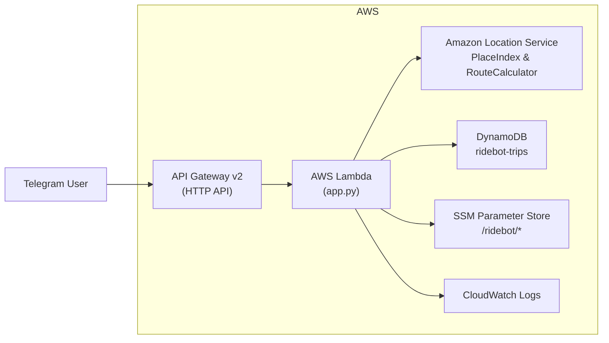

# 🚖 RideBot Infra

Cloud-native taxi booking assistant built with **AWS + Terraform + Telegram Bot**.  
The bot lets users order a ride via Telegram, calculates routes & prices with **Amazon Location Service**, stores trips in **DynamoDB**, and notifies drivers instantly.

---

## 🌐 Architecture



**Components:**
- **Terraform** – manages all infrastructure (API Gateway, Lambda, DynamoDB, IAM, SSM, Amazon Location).  
- **AWS Lambda (Python)** – core logic (Telegram webhook, route calculation, price rules).  
- **Amazon API Gateway** – webhook endpoint for Telegram.  
- **Amazon DynamoDB** – trip storage.  
- **Amazon Location Service** – geocoding + route calculation.  
- **SSM Parameter Store** – keeps bot token and driver profiles secure.  
- **GitHub Actions (OIDC)** – CI/CD pipeline for automated deploys.  

---

## 📂 Repository structure

```
ridebot-infra/
│
├── terraform/         # Infrastructure as Code (Terraform .tf files)
├── lambda_src/        # Source code for AWS Lambda
├── docs/              # Documentation, diagrams, guides
│   └── README.md      # Technical documentation
└── README.md          # This file (project overview)
```

---

## 🚀 Deployment

### 1. Local (Terraform)
```bash
cd terraform
terraform init
terraform apply -auto-approve
```

### 2. GitHub Actions (CI/CD)
- Push to `main` → triggers Terraform plan & apply via OIDC.  
- GitHub assumes role `ridebot-terraform-gha` in AWS.  
- Fully automated infra deployment.  

---

## 🔑 Secrets & Parameters

Secrets are stored in **AWS SSM Parameter Store**:
- `/ridebot/telegram_bot_token` – Telegram bot token.  
- `/ridebot/driver_profiles` – list of drivers (IDs, names, cars).  

Example driver config:
```json
[
  { "chat_id": "123456", "name": "Driver1", "car": "Honda Accord" },
  { "chat_id": "987654", "name": "Driver2", "car": "Toyota Sienna" }
]
```

---

## 👨‍💻 Features

✅ Order ride via Telegram (pick-up & drop-off)  
✅ Price calculation (minimum $10 for < 5 miles)  
✅ Driver notification via SMS/Telegram  
✅ Schedule rides (date & time picker)  
✅ Multi-driver support  
✅ Infrastructure fully managed by Terraform  

---


## 🛠 Tech Stack

- **AWS Lambda** (Python 3.11)  
- **Amazon API Gateway v2** (HTTP API)  
- **Amazon DynamoDB**  
- **Amazon Location Service**  
- **AWS SSM Parameter Store**  
- **Terraform**  
- **GitHub Actions (OIDC)**  

---

## 🧾 License

Released under the **MIT License** — feel free to use, fork, and learn from it.  
© Ruslan Dashkin (🚀Ruslan AWS)
Branding name “🚀Ruslan AWS” and related visuals are protected; commercial reuse or rebranding without permission is prohibited.
