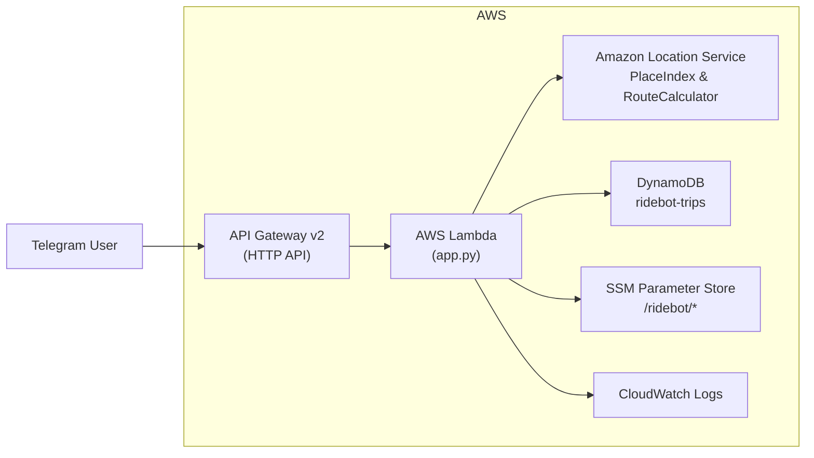

#  RideBot Infra

<p align="center">
  
  
  
  
  
  
  
  
  
</p>

Cloud-native ride booking system built with **AWS + Terraform + Telegram Bot**.  
The bot lets users order a ride via Telegram, calculates routes & prices with **Amazon Location Service**, stores trips in **DynamoDB**, and notifies drivers instantly.
> Educational/demo implementation of a serverless ride-booking workflow using AWS services. Not intended as a commercial multi-tenant platform.
---

##  Architecture



**Components:**
- **Terraform** – manages all infrastructure (API Gateway, Lambda, DynamoDB, IAM, SSM, Amazon Location).  
- **AWS Lambda (Python)** – core logic (Telegram webhook, route calculation, price rules).  
- **Amazon API Gateway** – webhook endpoint for Telegram.  
- **Amazon DynamoDB** – trip storage.  
- **Amazon Location Service** – geocoding + route calculation.  
- **SSM Parameter Store** – keeps bot token and driver profiles secure.  
- **GitHub Actions (OIDC)** – CI/CD pipeline for automated deploys.  

---

## **Project Structure**

```
ridebot-infra/
├── .github/          # GitHub workflows (infra.yml)
├── terraform/        # All Terraform infrastructure (API, Lambda, DynamoDB, SSM, Location)
├── lambda_src/       # Lambda function source code (app.py)
├── docs/             # ADRs, technical docs, limitations
├── .tflint.hcl       # Linter configuration for Terraform
├── LICENSE           # MIT license
└── README.md         # Project overview (main root README)
```

**Full detailed structure:** see [`docs/TECHNICAL.md`](./docs/TECHNICAL.md)

---

##  Deployment

### 1. Local (Terraform)
```bash
cd terraform
terraform init
terraform apply -auto-approve
```

### 2. GitHub Actions (CI/CD)
- Push to `main` → triggers Terraform plan & apply via OIDC.  
- GitHub assumes role `ridebot-terraform-gha` in AWS.  
- Fully automated infra deployment.  

---

##  Secrets & Parameters

Secrets are stored in **AWS SSM Parameter Store**:
- `/ridebot/telegram_bot_token` – Telegram bot token.  
- `/ridebot/driver_profiles` – list of drivers (IDs, names, cars).  

Example driver config:
```json
[
  { "chat_id": "123456", "name": "Driver1", "car": "Honda Accord" },
  { "chat_id": "987654", "name": "Driver2", "car": "Toyota Sienna" }
]
```

---

## Features

- Order ride via Telegram (pick-up & drop-off)  
- Price calculation (minimum $10 for < 5 miles)  
- Driver notification via SMS/Telegram  
- Schedule rides (date & time picker)  
- Multi-driver support  
- Infrastructure fully managed by Terraform   

---

##  Future Improvements

Planned enhancements to evolve this demo into a more robust, production-aligned service:

### **1. Observability**
- Add structured JSON logging (Powertools).
- Add basic CloudWatch dashboards for Lambda & API Gateway.

### **2. Security**
- Migrate SSM parameters to a dedicated KMS key.
- Introduce least-privilege IAM boundaries.

### **3. Data Model**
- Add TTL for user sessions and old trips.
- Add driver-centric GSI for listing active/assigned rides.

### **4. API & UX**
- Add `/health` endpoint.
- Add optional SMS notification (SNS) for confirmations.
- Add static map preview for pickup/dropoff points.

### **5. Infrastructure**
- Add staging environment + GitHub Actions protection rules.
- Add pre-commit hooks (tflint, tfsec, checkov).

---


##  Tech Stack

- **AWS Lambda** (Python 3.11)  
- **Amazon API Gateway v2** (HTTP API)  
- **Amazon DynamoDB**  
- **Amazon Location Service**  
- **AWS SSM Parameter Store**  
- **Terraform**  
- **GitHub Actions (OIDC)**  

---

## License

Released under the MIT License.  
See the LICENSE file for full details.

Branding name “🚀 Ruslan AWS” and related visuals may not be reused or rebranded without permission.

