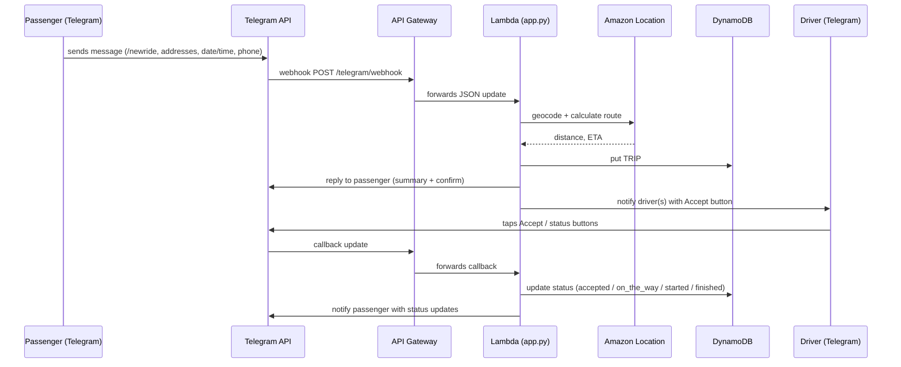

# 📘 RideBot — Technical Documentation

This document explains how the system is built and deployed: Terraform (AWS), Lambda (Python), API Gateway, DynamoDB, Amazon Location, SSM parameters, and CI/CD via GitHub Actions with OIDC.

---

## 🏗️ High-level architecture

```mermaid
graph TD
  TG[Telegram User] -->|Webhook updates| APIGW(API Gateway v2 - HTTP API)
  APIGW --> LBD[AWS Lambda (app.py)]
  LBD --> GEO[Amazon Location Service<br/>• PlaceIndex<br/>• RouteCalculator]
  LBD --> DDB[(DynamoDB<br/>ridebot-trips)]
  LBD --> SSM[SSM Parameter Store<br/>/ridebot/*]
  LBD --> TGAPI[Telegram Bot API]
  subgraph IaC
    TF[Terraform] --> APIGW
    TF --> LBD
    TF --> DDB
    TF --> GEO
    TF --> SSM
    TF -->|IAM| IAM[(IAM Roles/Policies)]
  end
```

---

## 🔁 Message flow (sequence)



---

## 📦 Terraform modules (folder: `terraform/`)

- **`backend.tf`** – remote state in S3 (`ridebot-terraform-state`), lock table `ridebot-tf-locks`.
- **`identity.tf`** – `data.aws_caller_identity` and `data.aws_partition` used in ARNs.
- **`iam.tf`** – Lambda execution role + policy granting:
  - CloudWatch Logs (create streams, put events)
  - DynamoDB CRUD for table `ridebot-trips`
  - SSM read `/ridebot/*` (+ KMS decrypt for `alias/aws/ssm`)
  - Amazon Location (`SearchPlaceIndexForText`, `CalculateRoute`)
- **`dynamodb.tf`** – table `ridebot-trips` with `PK`/`SK`, (plus optional GSIs if needed).
- **`lambda.tf`** – Lambda function `ridebot-handler` packaged from `lambda_src` (or `lambda_src.zip`).
- **`apigw.tf`** – HTTP API + route `POST /telegram/webhook`, integration with Lambda.
- **`outputs.tf`** – `webhook_url`, API base URL, resource names.
- **`webhook.tf` (optional)** – local-exec that resets Telegram webhook after apply.

> After `apply`, the CI also resets the webhook to the fresh API URL (see CI below).

### Init & deploy

```bash
cd terraform
terraform init -reconfigure      # picks S3 backend
terraform plan -out=tfplan
terraform apply -auto-approve tfplan
```

### Useful outputs

```bash
terraform output -json | jq
# webhook_url, api_base_url, dynamodb_table, place_index_name, route_calculator_name
```

---

## 🔐 SSM Parameters (Parameter Store)

Create once:

- `/ridebot/telegram_bot_token` – **SecureString**, your BotFather token.
- `/ridebot/driver_profiles` – **String** or **SecureString**. Example:
  ```json
  [
    {"chat_id":"123456", "name":"Ruslan", "car":"Toyota Sienna"},
    {"chat_id":"987654", "name":"Lenora", "car":"Toyota Sienna"}
  ]
  ```

*(Legacy)* `/ridebot/driver_chat_id` may exist but is ignored.

---

## 🐍 Lambda app (`lambda_src/app.py`)

Main responsibilities:

- Parse Telegram updates (messages + callbacks).
- States: address collection → price summary → date/time pickers → phone capture → confirm.
- Price rule: **min $10** for < 5 miles.
- Persist trip in DynamoDB (`TRIP#<id>`).
- Notify drivers; handle their actions: **Accept**, **On the way**, **Trip started**, **Trip finished**.
- Disable passenger buttons after driver acceptance.
- English-only UI.

Environment variables (set in `lambda.tf`):
- `TABLE_NAME` = `ridebot-trips`
- `PLACE_INDEX_NAME` = `ridebot-places`
- `ROUTE_CALCULATOR_NAME` = `ridebot-routes`

---

## 🤖 CI/CD (GitHub Actions with OIDC)

Workflow: `.github/workflows/deploy.yml`

- **Push to `main`** → `terraform plan` + `apply` (OIDC role: `arn:aws:iam::097635932419:role/ridebot-terraform-gha`).
- **Manual run** (`workflow_dispatch`) with `action=destroy` to tear down infra.
- **Post-apply step** resets Telegram webhook automatically:
  1. Read `webhook_url` from `terraform output`.
  2. Read token from SSM.
  3. Call Telegram `setWebhook` with the new URL.

Trust policy allows: branch `main` and environment `production` for destroy.

---

## 🧪 Local cleanliness & backend

If you previously had local state, you may clean it safely:

```bash
rm -rf .terraform .terraform.lock.hcl terraform.tfstate terraform.tfstate.backup
terraform init -reconfigure
```

Remote backend: S3 bucket `ridebot-terraform-state`, key `global/terraform.tfstate`, lock table `ridebot-tf-locks`.

---

## ➕ Adding drivers

1. Update SSM `/ridebot/driver_profiles` JSON array with a new object:
   ```json
   {"chat_id":"111222333", "name":"New Driver", "car":"Camry"}
   ```
2. No redeploy needed — Lambda fetches from SSM at runtime (or on cold-start).
3. Driver must **start a chat** with your bot to allow direct messages.

---

## 🧰 Troubleshooting

- **No driver notifications**: verify `/ridebot/driver_profiles`, driver chat IDs, and that drivers pressed **Start** with the bot.
- **Webhook 404**: re-check API Gateway route `POST /telegram/webhook`, Lambda logs, and that webhook URL equals the current `terraform output -raw webhook_url`.
- **AccessDenied in CI**: ensure the IAM policy attached to `ridebot-terraform-gha` includes required actions (Lambda, APIGW, DynamoDB, SSM, Logs, IAM where needed) and trust policy matches repo/branch.

---

## 💸 Cost notes

- Lambda + API Gateway + DynamoDB + Location are pay-per-use; typical dev costs are very low.
- DynamoDB on-demand is recommended for simplicity.
- Location Service charges per request (geocoding & routing). Cache repeated addresses if necessary.

---

## 📄 License

MIT
