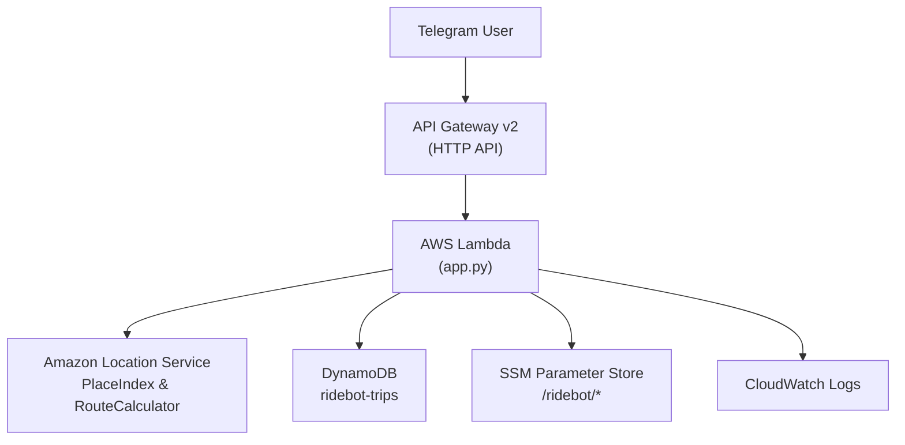
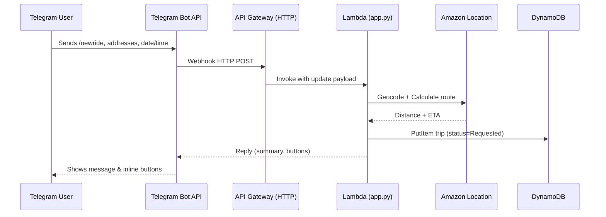
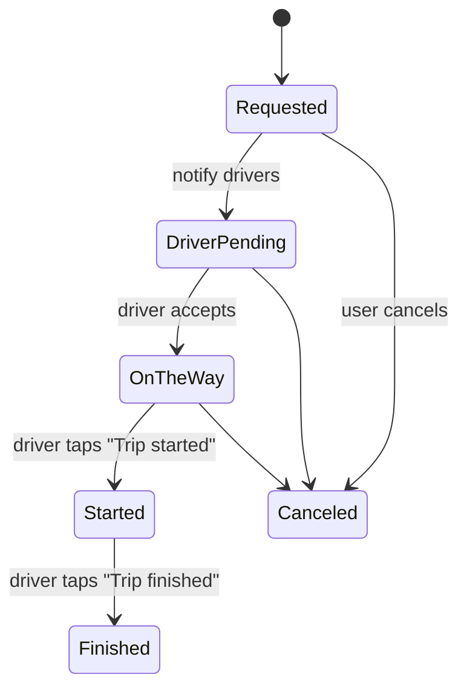

# 🚖 RideBot — Technical Documentation

This document explains how the system is built and deployed: **Terraform (AWS)**, **Lambda (Python)**, **API Gateway**, **DynamoDB**, **Amazon Location**, **SSM Parameters**, and **CI/CD** via **GitHub Actions** (OIDC).

---

## 📐 High-level architecture


*If GitHub still fails to render, ensure the fenced block starts with exactly <code>```mermaid</code> and you are viewing it on github.com (Mermaid is not rendered in some IDE previews).*

---

## 🔁 Request flow



---

## 🚦 Trip status state machine



---

## 🗂 Repository structure

```
ridebot-infra/
├── docs/             # Documentation (this file)
├── lambda_src/       # Python source for Lambda (app.py, etc.)
├── lambda_src.zip    # Deployment artifact for Lambda
├── terraform/        # Terraform IaC (APIGW, Lambda, DynamoDB, IAM, etc.)
└── .github/workflows # GitHub Actions workflows
```

---

## 🧩 Components

- **Lambda (`app.py`)**
  - Handles Telegram webhook, flow, validation, and messages.
  - Uses Amazon Location for geocoding & routing.
  - Pricing rule: **minimum $10 if distance < 5 miles**.
  - AM/PM time picker (30-min steps), buttons become disabled after confirm.
  - Status buttons for driver: **On the way → Trip started → Trip finished**.

- **API Gateway v2 (HTTP API)**  
  Public `/telegram/webhook` that invokes Lambda.

- **DynamoDB (`ridebot-trips`)**
  - Primary key (`pk`): `TRIP#<id>`
  - Sort key (`sk`): e.g., `META` (main row) or `EVT#<timestamp>` (history).

- **Amazon Location**
  - **PlaceIndex** to resolve addresses.
  - **RouteCalculator** to compute distance & ETA.

- **SSM Parameter Store**
  - `/ridebot/telegram_bot_token` — Telegram bot token.
  - `/ridebot/driver_chat_ids` — JSON array of driver chat IDs.
  - `/ridebot/driver_profiles` — JSON array with `{chat_id,name,car}`.

- **CloudWatch Logs**
  - Lambda logs for debugging.

---

## 🗃 DynamoDB data model

**Table:** `ridebot-trips` (on-demand)

| Attribute           | Type   | Example / Notes                                      |
|--------------------|--------|-------------------------------------------------------|
| `pk`               | String | `TRIP#7toaax`                                         |
| `sk`               | String | `META` or `EVT#2025-09-19T21:32:10Z`                  |
| `status`           | String | `Requested`, `DriverPending`, `OnTheWay`, `Started`, `Finished`, `Canceled` |
| `pickup_*`/`dropoff_*` | Mixed | address text + lat/lng                                |
| `distance_miles`   | Number | `1.6` (min fare rule if `< 5`)                        |
| `eta_min`          | Number | `6`                                                   |
| `price_usd`        | Number | `10.00`                                               |
| `schedule_date`    | String | `2025-09-20`                                          |
| `schedule_time`    | String | `11:30 PM`                                            |
| `schedule_iso`     | String | `2025-09-20T23:30:00-05:00`                           |
| `passenger_phone`  | String | `+1 850 555 0100`                                     |
| `driver_chat_id`   | String | `"123456789"`                                         |
| `driver_name`      | String | `"Name"`                                            |
| `driver_car`       | String | `"Toyota Sienna"`                                     |
| `created_at_iso`   | String | ISO timestamp                                         |
| `updated_at_iso`   | String | ISO timestamp                                         |

**Example item (`META`):**
```json
{
  "pk": "TRIP#7toaax",
  "sk": "META",
  "status": "DriverPending",
  "pickup_address": "2055 Alfred Blvd, Navarre, FL",
  "dropoff_address": "7458 Treasure St, Navarre, FL",
  "distance_miles": 1.6,
  "eta_min": 6,
  "price_usd": 10.0,
  "schedule_date": "2025-09-20",
  "schedule_time": "11:30 PM",
  "schedule_iso": "2025-09-20T23:30:00-05:00",
  "passenger_phone": "+1 850 555 0100",
  "driver_chat_id": "123456789",
  "driver_name": "Name",
  "driver_car": "Toyota Sienna",
  "created_at_iso": "2025-09-19T21:30:04Z",
  "updated_at_iso": "2025-09-19T21:32:10Z"
}
```

---

## 🚀 Deploy

### 1) Prereqs (one-time)
Create SSM parameters:
```bash
aws ssm put-parameter --name /ridebot/telegram_bot_token --type SecureString --value "<BOT_TOKEN>"
aws ssm put-parameter --name /ridebot/driver_chat_ids --type String --value '["<CHAT_ID_1>","<CHAT_ID_2>"]'
aws ssm put-parameter --name /ridebot/driver_profiles --type String --value '[{"chat_id":"<CHAT_ID_1>","name":"Name","car":"Toyota Sienna"},{"chat_id":"<CHAT_ID_2>","name":"Lenora","car":"Toyota Sienna"}]'
```

### 2) Local Terraform
```bash
cd terraform
terraform init -reconfigure
terraform apply -auto-approve
```

### 3) GitHub Actions (CI/CD)
- Workflow: `.github/workflows/deploy.yml`
- Push to `main` → plan + apply via role `arn:aws:iam::097635932419:role/ridebot-terraform-gha`
- Post-apply step re-sets Telegram webhook to the latest API URL.

---

## 🔎 Verify webhook

```bash
TOKEN=$(aws ssm get-parameter --name /ridebot/telegram_bot_token --with-decryption --query 'Parameter.Value' --output text)
curl -s "https://api.telegram.org/bot${TOKEN}/getWebhookInfo"
```
You should see your current API Gateway URL in `url`.

---

## 🛠 Troubleshooting

- **Mermaid “Unable to render”**  
  - Blocks must start with ```mermaid and end with three backticks.  
  - Use `<br/>` inside labels for line breaks (not `\n`).  
  - View on github.com (some IDE previews don't render Mermaid).

- **Bot silent after re-deploy**  
  - Check `terraform output webhook_url` and `getWebhookInfo`.  
  - CI should set it automatically; if not, set manually with `setWebhook`.

- **AccessDenied in CI**  
  - Ensure your OIDC role trust policy includes your repo and branch.  
  - Policy must allow the IAM, Lambda, APIGW, DynamoDB, Geo, Logs, and SSM actions.

---

## 💵 Cost notes

- **Lambda + API Gateway** — pay per request (very low at small scale).  
- **DynamoDB** — on-demand; cents per month with small traffic.  
- **Amazon Location** — per-request billing; geocode & routes only when needed.  
- **SSM Parameter Store** — standard tier for a few parameters is effectively free.
