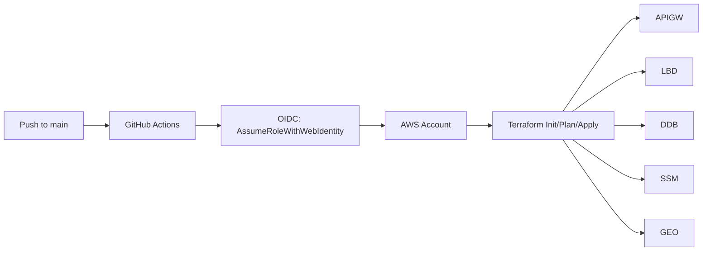
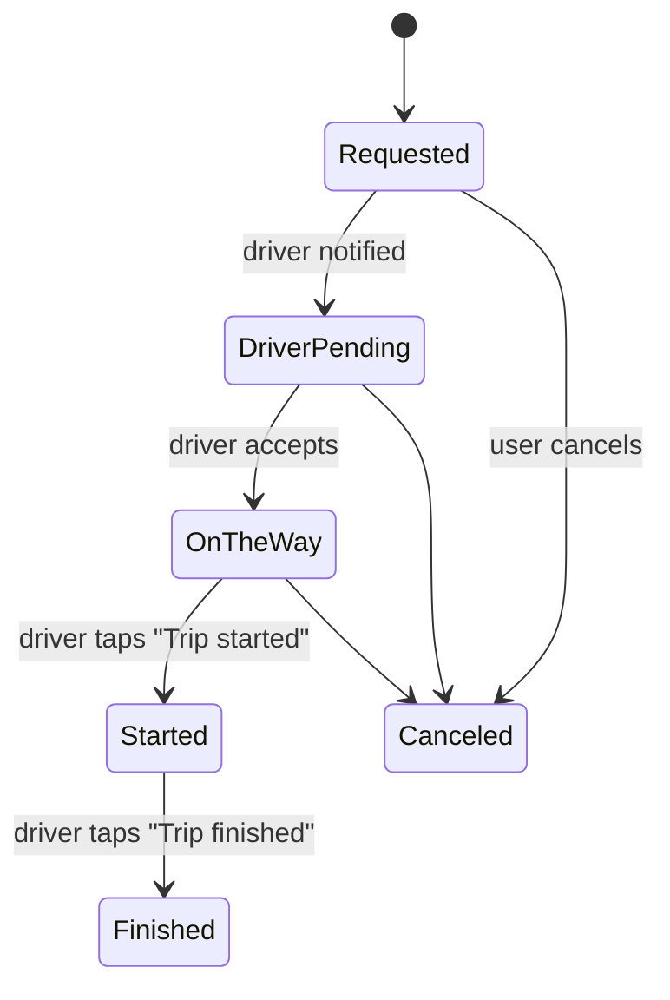

# 🚖 RideBot — Technical Documentation

This document explains how the system is built and deployed: Terraform (AWS), Lambda (Python), API Gateway, DynamoDB, Amazon Location, SSM parameters, and CI/CD via GitHub Actions with OIDC.

---

## 📐 High‑level architecture

```mermaid
graph TD
  TG[Telegram User] --> APIGW[API Gateway v2 (HTTP API)]
  APIGW --> LBD[AWS Lambda (app.py)]
  LBD --> GEO[Amazon Location Service\nPlaceIndex + RouteCalculator]
  LBD --> DDB[DynamoDB\nridebot-trips]
  LBD --> SSM[SSM Parameter Store\n/ridebot/*]
  LBD --> LOGS[CloudWatch Logs]
```
> If you still see an error on GitHub, ensure the block begins with ```mermaid (exactly) and ends with three backticks.

---

## 🚚 CI/CD deployment flow


---

## 🚦 Trip status state machine


---

## DynamoDB data model (summary)

- **Table**: `ridebot-trips` (on‑demand)
- **PK**: `pk` (e.g. `TRIP#<id>`), **SK**: `sk` (e.g. `META`)
- Key attributes: pickup/dropoff addresses & geo, distance, ETA, price (min $10 if < 5 mi), scheduled date/time, passenger phone, driver info, status.

Example:
```json
{
  "pk": "TRIP#7toaax",
  "sk": "META",
  "status": "DriverPending",
  "pickup_address": "2055 Alfred Blvd, Navarre, FL",
  "dropoff_address": "7458 Treasure St, Navarre, FL",
  "distance_miles": 1.6,
  "eta_min": 6,
  "price_usd": 10.0
}
```

---

## Webhook check

```bash
TOKEN=$(aws ssm get-parameter --name /ridebot/telegram_bot_token --with-decryption --query 'Parameter.Value' --output text)
curl -s "https://api.telegram.org/bot${TOKEN}/getWebhookInfo"
```

